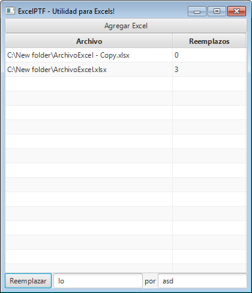

# Aplicación de Escritorio para manejo de planillas Excel con Java  

# Bienvenido a la Guía de Java y Excel!

Haremos una aplicación de escritorio Java para Windows, Linux o Mac con manejo de planillas Excel!

Vamos a construir juntos un programa de escritorio, con el lenguaje Java, que nos permita Leer, Crear y Modificar archivos Excel.

## Conceptos previos (te avisaremos cuando necesites aprenderlos)  
En esta guía no explicamos:  
1. En profundidad los fundamentos de la Programación Orientada a Objetos (POO)  
2. La sintaxis del lenguaje Java.  
3. Nociones básicas como: que es un lenguaje, que es un compilador, que es una aplicación.  

Pero la guía arranca como para el que no sabe nada, e igualmente dedicaremos unos segundos a estos conceptos citados.  
Lo que sí, te pediremos que los profundices y aprendas bien con tu mentor o uses los links que te sugerimos acá!  

## Que temas veremos?  

Los siguiente:  
- Java como lenguaje Orientado a Objetos.  
- Construcción de una interfaz de usuario con JavaFX.  
- Utilización de Librerías de terceros para agregar funcionalidades a nuestra aplicación: en nuestro caso, el manejo de planillas Excel.  
## Que desarrollaremos?  

En el siguiente orden:  
1. Vamos a crear una interfaz sencilla que nos permita seleccionar un Excel que esté en nuestra computadora.  
2. Vamos a buscar alguna palabra o número dentro del Excel e informar su ubicación.  
3. Vamos a reemplazar una palabra por otra dentro de uno o mas Excels.  
4. Agregar Pestañas a la aplicación, para que las distintas partes coexistan.  
5. Vamos a seleccionar un Excel y hacerle todas unas modificaciones y adaptarlo para que otro programa lo pueda leer.  

## Imágenes de la aplicación final  
La aplicación final lucirá de la siguiente forma:  
  
  
  
  
  

Empecemos!

## Indice  

1. [Conceptos previos](docs/1-conceptos-previos.md)  
2. [Instalación del Entorno de trabajo](docs/2-entorno-de-trabajo.md)  
3. [Creación del primer programa](docs/3-creacion-programa.md)  
4. [Código base del programa](docs/4-codigo-por-defecto.md)  
5. [Programar con JavaFX](docs/5-programar_javafx.md)  
6. [Nuesta primer Interfaz](docs/6-primer-interfaz.md)  
7. [Vida y Handlers a nuestra Interfaz](docs/7-primer-handler.md)  
8. [Buenas prácticas](docs/8-MVC.md)  
9. [Búsqueda dentro de un Excel](docs/9-busqueda.md)  
10. [Búsqueda y reemplazo dentro de uno o mas Excels](docs/10-buscar-y-reemplazar.md)  
11. [Unificando la interfaz con Pestañas](docs/11-pestanas.md)  
12. [Un proceso Personalizado!](docs/12-proceso-personalizado.md)    

[Siguiente ->](docs/1-conceptos-previos.md) (1. Conceptos previos)  
