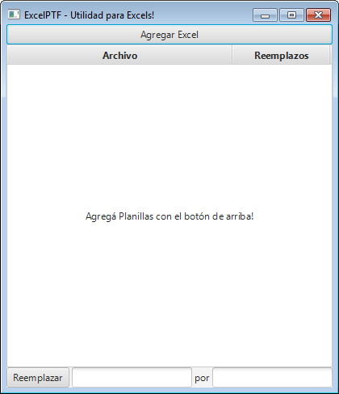
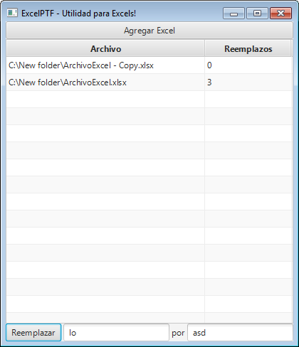

# Buscar y reemplazar!

Recordemos lo que nos propusimos:  
1. Crear una interfaz sencilla que nos permita seleccionar un Excel que esté en nuestra computadora. **(HECHO!)**  
2. Vamos a buscar alguna palabra o número dentro del Excel e informar su ubicación. **(HECHO!)**  
3. **Vamos a reemplazar una palabra por otra dentro de uno o mas Excels.**  
4. Vamos a seleccionar un Excel y hacerle todas unas modificaciones y adaptarlo para que otro programa lo pueda leer.  

Ahora vamos por el punto 3!  

Crearemos la siguiente interfaz:  
  

En la parte superior está el botón que nos permitirá agregar Excels a nuestra tabla de Excels.  

Como decíamos antes, esta pantalla nos permitirá reemplazar palabras en uno o mas Excels. Será útil si tenemos muchos archivos y queremos cambiar algo por otra cosa, en todos a la vez, sin tener que entrar uno por uno.  

En el medio hay una tabla con dos columnas. La columna *Archivo* tendrá las rutas de los archivos que vayamos agregando. En la columna *Reemplazos* se marcará la cantidad de reemplazos que se hicieron en cada archivo.  

Luego, en la parte inferior, tenemos dos cajones de texto. En el primero escribiremos el texto a buscar, y en el segundo, el texto nuevo a reemplazar.  

Con el botón *Reemplazar* pasamos a realizar la operación.  

## Creamos **PanelBuscarYReemplazar**  

Entonces creemos un nuevo panel, que hará este nuevo trabajo.  

Para eso creamos la clase **PanelBuscarYReemplazar**:

```java  
package application;

import java.io.File;
import java.io.IOException;
import java.util.List;

import javafx.geometry.Pos;
import javafx.scene.control.Button;
import javafx.scene.control.Label;
import javafx.scene.control.TableColumn;
import javafx.scene.control.TableRow;
import javafx.scene.control.TableView;
import javafx.scene.control.TextField;
import javafx.scene.control.cell.PropertyValueFactory;
import javafx.scene.layout.BorderPane;
import javafx.scene.layout.HBox;
import javafx.scene.layout.Priority;
import javafx.stage.FileChooser;
import javafx.stage.FileChooser.ExtensionFilter;
import javafx.stage.Stage;

public class PanelBuscarYReemplazar extends BorderPane{

}
```  

Esos son los *imports* que vamos a necesitar. Mas adelante veremos como hacer cuando no sepamos cuales imports necesitaremos de antemano (como en realidad siempre nos sucede en la vida real).  

Notar que la clase *extiende* de **BorderPane**. Eso significa que nuestra clase va a ser un panel con todas las características de un **BorderPane**, mas las características y código que nosotros sumemos.  

En los próximos pasos veremos mas sobre el **BorderPane** y todo lo que nos facilita.  

## Cambiamos el **Main**  

Ahora vamos a modificar nuestra clase **Main** de la siguiente forma, para que en vez de tomar el **PanelBusqueda** anterior que habíamos hecho, use el nuevo que acabamos de hacer:  

```java  
package application;

import javafx.application.Application;
import javafx.scene.Scene;
import javafx.stage.Stage;

public class Main extends Application {
	@Override
	public void start(Stage primaryStage) {
		try {

			PanelBuscarYReemplazar root = new PanelBuscarYReemplazar(primaryStage);

			Scene scene = new Scene(root);
			scene.getStylesheets().add(getClass().getResource("application.css").toExternalForm());

			primaryStage.setTitle("ExcelPTF - Utilidad para Excels!");
			primaryStage.setScene(root.getScene());
			primaryStage.show();

		} catch(Exception e) {
			e.printStackTrace();
		}
	}

	public static void main(String[] args) {
		launch(args);
	}
}
```  

Al final de este tutorial crearemos una pantalla con pestañas, para que todas las pantallas que creamos puedan coexistir en la misma aplicación!  

## Una clase que nos ayudará con los Excels  

Ahora nuestra aplicación ya no manipulará un solo archivo. Va a manejar muchos al mismo tiempo.  

Ya no es cuestión de guardar una ruta en una variable, sino todas las rutas de los distintos archivos, y también la cantidad de reemplazos efectuados en cada uno de ellos.  

Es por eso que crearemos una clase simple y pequeña llamada **ArchivoExcel**. En ella se guardará, para cada Excel en particular, su ruta y cantidad de reemplazos sufridos:  

```java  
package application;

import javafx.beans.property.SimpleStringProperty;
import javafx.beans.property.StringProperty;

public class ArchivoExcel {

	private final StringProperty ruta;
	private final StringProperty reemplazos;

	public ArchivoExcel(String ruta, String reemplazos) {
		this.ruta = new SimpleStringProperty(ruta);
		this.reemplazos = new SimpleStringProperty(reemplazos);
	}

	public StringProperty rutaProperty(){
		return ruta;
	}

	public StringProperty reemplazosProperty(){
		return reemplazos;
	}

	public void setReemplazos(String reemplazos){
		this.reemplazos.setValue(reemplazos);
	}

}
```  
### StringProperty  

¿Por que usamos **StringProperty** para guardar la *ruta* del archivo, y no usamos simplemente **String**?  
Hacemos eso porque en la tabla que después usaremos, necesitamos que los campos que se muestren en la misma, estén guardados en este tipo.  
Esto, como veremos adelante, nos facilitará mucho la tarea y, en vez de hacer manualmente el manejo y modificaciones de los datos en la tabla, las hará automáticamente la tabla. Para que esto suceda, los que hicieron ese código nos piden que usemos este tipo de variables, en vez de las tradicionales.  

Por que usamos **StringProperty** en *reemplazos* en vez de guardar un número? Porque si llegara a fallar la operación, como veremos mas adelante, vamos a querer mostrar el mensaje de error en texto.  

## Diseñamos el **PanelBuscarYReemplazar**  

### **BorderPane**  

Como dijimos, vamos a basar nuestro panel en el **BorderPane**. Antes habíamos basado el panel **PanelBusqueda** en el tipo **HBox**.  
El **HBox** sirve para poner componentes en pantalla, y todos se dispongan uno al lado del otro, horizontalmente.  

Pero en nuestro caso tenemos una interfaz un poco mas complicada. Solo con componentes uno al lado de otro no la podemos lograr.  

Es por esto que acudimos al **BorderPane**. Tiene la siguiente estructura y disposición de elementos:  

  

Que significa eso? Que, cuando agreguemos elementos al panel, le indicaremos en que zona queremos que se agreguen.  

Entonces, al boton de *Agregar Excel* lo pondremos en la zona *Top*.  
A la tabla la pondremos en la zona *Center*.  
Al botón *Reemplazar* y los cajones de texto, en *Bottom*.  
Las zonas *Left* y *Right* las dejaremos vacías.  

### Elementos en pantalla  

Dentro de la clase, creamos los siguientes elementos:  

```java  
public class PanelBuscarYReemplazar extends BorderPane{

	Button botonAgregarExcel;

	TableView<ArchivoExcel> tabla;

	TextField cajonBuscar;
	Label textoPor;
	TextField cajonReemplazar;
	Button botonReemplazar;

	Stage primaryStage;
}
```  

Declaramos la variable llamada *botonAgregarExcel* de tipo **Button**.

Declaramos la variable llamada *tabla* de tipo **TableView<ArchivoExcel>**. Agregando el nombre de la clase que creamos, **ArchivoExcel**, entre mayor y menor, le indicamos a la **TableView** que el tipo de dato que mostrará es **ArchivoExcel**.  

Declaramos la variable llamada *cajonBuscar* de tipo **TextField**. Es el cajón en donde pondremos el texto a buscar.  

Declaramos la variable llamada *cajonReemplazar* de tipo **TextField**. Es el cajón en donde pondremos el texto nuevo que reemplazará al buscado.  

Declaramos la variable llamada *textoPor* de tipo **Label**. Simplemente es la encargada de mostrar la palabra "por" entre los dos cajones de texto.  

### Constructor  

Creamos el constructor del panel:  
```java  
	public PanelBuscarYReemplazar(Stage primaryStage) {
		this.primaryStage=primaryStage;
		inicializarComponentes();		
		crearHandlers();
	}
```  

### Inicializar componentes  

Esta es la parte mas complicada del panel.
```java  
Creamos el método **inicializarComponentes**:  

	private void inicializarComponentes() {
	
	}
```  

#### Top  

Empezamos por lo que aparecerá en la zona superior, **TOP**.  

Inicializamos al botón **botonAgregarExcel**:  
```java  
	private void inicializarComponentes() {		
		botonAgregarExcel = new Button("Agregar Excel");
		botonAgregarExcel.setMaxWidth(Double.MAX_VALUE);
		setTop(botonAgregarExcel );
	}
```  

Con el método **setMaxWidth**, le indicamos el ancho máximo que puede tomar el botón. Al ponerle *Double.MAX_VALUE*, le decimos que se haga del mayor ancho que pueda. Eso hace que el botón se ará todo lo ancho que pueda dentro de la ventana, tomando todo el espacio disponible hacia los costados.  

Finalmente, lo agregamos a la zona **Top** de nuestro panel con el método **setTop**.  

#### Bottom  

Dejaremos la parte del centro para el final, así que ahora agregaremos el código de la parte inferior al método **inicializarComponentes**:  

```java  		
		botonReemplazar = new Button("Reemplazar");
		cajonBuscar = new TextField();
		textoPor = new Label("por");
		cajonReemplazar = new TextField();
```  
Inicializamos los elementos *botonReemplazar*, *cajonBuscar*, *textoPor* y *cajonReemplazar*.  

Ahora, queremos que todos esos elementos estén en la parte **Bottom** del panel, abajo.  

Pero el **BorderPane** tiene un método **setBottom** que solo admite un único elemento...  

Como hacemos? Creamos un panel **HBox**, agregamos todos los componentes a ese, y es al **HBox** al que ponemos en la zona **Bottom** del **BorderPane**:  

```java  		
		botonReemplazar = new Button("Reemplazar");
		cajonBuscar = new TextField();
		textoPor = new Label("por");
		cajonReemplazar = new TextField();

		HBox hbox = new HBox();
		hbox.setAlignment(Pos.CENTER);
		hbox.setSpacing(3);

		hbox.getChildren().add(botonReemplazar);
		hbox.getChildren().add(cajonBuscar);
		hbox.getChildren().add(textoPor);
		hbox.getChildren().add(cajonReemplazar);

		HBox.setHgrow(cajonReemplazar, Priority.ALWAYS);
		HBox.setHgrow(cajonBuscar, Priority.ALWAYS);

		setBottom(hbox);
```  

El método **setAlignment** de *hbox* nos permite indicarles la alineación vertical de los componentes. Al indicarle Center, le decimos que se centren de forma vertical. Probá borrar o modifiar esta linea para ver como cambia en pantalla la visualización de los elementos.  
Como *hbox* tiene 4 elementos, le tenemos que indicar cuales son los que estirará si el panel se agranda o achica. Eso se hace con la ayuda del método **setHgrow**. Le indicamos que tenga prioridad Always ("siempre" en ingles) los dos cajones de texto. Probá modificar o borrar esas dos lineas también.  

#### Center  

Agregamos el código para la tabla, que estará en la zona **Center** del **BorderPane**, dentro del método **inicializarComponentes**.  

Inicializamos la tabla:  

```java  
		tabla = new TableView<ArchivoExcel>();
		tabla.setPlaceholder(new Label("Agregá Planillas con el botón de arriba!"));
```  
El método **setPlaceholder** permite modificar lo que se muestra en la tabla cuando todavía no hay elementos agregados. En nuestro caso elegimos que se muestre un **Label** indicando como agregar las planillas.  

Creamos las columnas:  

```java  
		TableColumn<ArchivoExcel, String> archivoCol = new TableColumn<ArchivoExcel, String>("Archivo");
	        archivoCol.setCellValueFactory(new PropertyValueFactory<ArchivoExcel, String>("ruta"));

        	TableColumn<ArchivoExcel, String> reemplazosCol = new TableColumn<ArchivoExcel, String>("Reemplazos");
        	reemplazosCol.setCellValueFactory(new PropertyValueFactory<ArchivoExcel, String>("reemplazos"));
```  

Creamos los elementos *archivoCol* y *reemplazosCol*, ambos del tipo **TableColumn<ArchivoExcel,String>**. Esto significa que son columnas de tipo **String** y de elemento de tipo **ArchivoExcel**.  

Con el método **setCellValueFactory**, le indicamos cual de los atributos de la clase **ArchivoExcel** es el que se mostrará en cada columna. Por ejemplo, para *archivoCol*, le indicamos que se usará el atributo *ruta*. Ya con escribir esa linea, hacemos que cuando modifiquemos el atributo *ruta* de un item del tipo **ArchivoExcel** que esté en la tabla, automáticamente se modifique el dato en la tabla.  

Tomate tu tiempo para leer y entender bien estas lineas, no son simples!  


```java  
        	archivoCol.prefWidthProperty().bind(tabla.widthProperty().multiply(0.69));
        	reemplazosCol.prefWidthProperty().bind(tabla.widthProperty().multiply(0.3));
```  
Con el método **preffWidthProperty**, damos el porcentaje que queremos que cada columna ocupe en la tabla. Es una mera cuestión estética, podes jugar con los valores y borrar esas lineas para ver como impacta en lo visual.  


Luego agregamos las columnas a la tabla, y agregamos la tabla a la zona **Center** del **BorderPane**:  
```java  
        	tabla.getColumns().add(archivoCol);
        	tabla.getColumns().add(reemplazosCol);

        	setCenter(tabla);
```  

### Código hasta ahora:  

Esta parte no es nada fácil! así que tomate tu tiempo para entender este método, y consultale a tu mentor todo lo que necesites.  

Con lo escrito hasta ahora ya deberías poder ver la pantalla, sin tener ninguna acción todavía.  
```java  
	package application;

import java.io.File;
import java.io.IOException;
import java.util.List;

import javafx.geometry.Pos;
import javafx.scene.control.Button;
import javafx.scene.control.Label;
import javafx.scene.control.TableColumn;
import javafx.scene.control.TableRow;
import javafx.scene.control.TableView;
import javafx.scene.control.TextField;
import javafx.scene.control.cell.PropertyValueFactory;
import javafx.scene.layout.BorderPane;
import javafx.scene.layout.HBox;
import javafx.scene.layout.Priority;
import javafx.stage.FileChooser;
import javafx.stage.FileChooser.ExtensionFilter;
import javafx.stage.Stage;

public class PanelBuscarYReemplazar extends BorderPane{

	Button botonAgregarExcel;

	TableView<ArchivoExcel> tabla;

	TextField cajonBuscar;
	Label textoPor;
	TextField cajonReemplazar;
	Button botonReemplazar;


	Stage primaryStage;

	public PanelBuscarYReemplazar(Stage primaryStage) {
		this.primaryStage=primaryStage;
		inicializarComponentes();		
		crearHandlers();
	}

	private void inicializarComponentes() {
		//TOP
		botonAgregarExcel = new Button("Agregar Excel");
		botonAgregarExcel.setMaxWidth(Double.MAX_VALUE);
		setTop(botonAgregarExcel );

		//BOTTOM
		botonReemplazar = new Button("Reemplazar");
		cajonBuscar = new TextField();		
		textoPor = new Label("por");
		cajonReemplazar = new TextField();

		HBox hbox = new HBox();
		hbox.setAlignment(Pos.CENTER);
		hbox.setSpacing(3);

		hbox.getChildren().add(botonReemplazar);
		hbox.getChildren().add(cajonBuscar);
		hbox.getChildren().add(textoPor);
		hbox.getChildren().add(cajonReemplazar);

		HBox.setHgrow(cajonReemplazar, Priority.ALWAYS);
		HBox.setHgrow(cajonBuscar, Priority.ALWAYS);

		setBottom(hbox);

		//CENTER
		tabla = new TableView<ArchivoExcel>();
		tabla.setPlaceholder(new Label("Agregá Planillas con el botón de arriba!"));

		TableColumn<ArchivoExcel, String> archivoCol = new TableColumn<ArchivoExcel, String>("Archivo");
        	archivoCol.setCellValueFactory(new PropertyValueFactory<ArchivoExcel, String>("ruta"));

        	TableColumn<ArchivoExcel, String> reemplazosCol = new TableColumn<ArchivoExcel, String>("Reemplazos");
        	reemplazosCol.setCellValueFactory(new PropertyValueFactory<ArchivoExcel, String>("reemplazos"));

        	archivoCol.prefWidthProperty().bind(tabla.widthProperty().multiply(0.69));
        	reemplazosCol.prefWidthProperty().bind(tabla.widthProperty().multiply(0.3));

        	tabla.getColumns().add(archivoCol);
        	tabla.getColumns().add(reemplazosCol);

        	setCenter(tabla);
	}

}
```  

## Damos vida al **PanelBuscarYReemplazar**  

Ahora, para que cuando apretamos los botones, sucedan cosas, vamos a crear el método **crearHandlers**, y le asignamos acciones a *botonAgregarExcel* y *botonReemplazar*:  
```java  
	private void crearHandlers() {
        	botonAgregarExcel.setOnAction(e -> seleccionarArchivo());

        	botonReemplazar.setOnAction(e -> reemplazar());
	}
```  

### selecionarArchivo  

Creamos el método **seleccionarArchivo**:  

```java  
	private void seleccionarArchivo() {
		FileChooser selectorDeArchivo = new FileChooser();
		selectorDeArchivo.setTitle("Seleccioná un archivo Excel");
		selectorDeArchivo.getExtensionFilters().addAll(new ExtensionFilter("Excel", "*.xlsx"));

		List<File> archivosSeleccionados = selectorDeArchivo.showOpenMultipleDialog(primaryStage);

		for(File archivo: archivosSeleccionados)
			if (archivo != null)
				tabla.getItems().add(new ArchivoExcel(archivo.getAbsolutePath(), "0"));
	}
```  
Primero creamos el *selectorDeArchivo*, como hacíamos antes, del tipo **FileChooser**.  
Le cambiamos el título con el método **setTitle**.  
Le agregamos algo nuevo: que sólo nos deje seleccionar los archivos de tipo **.xlsx**. Esto lo hacemos con el método **getExtensionFilters**.  

Esta vez, vamos a permitir que el usuario seleccione mas de un Excel a la vez. Por eso, en vez de guardar una ruta de un archivo en un **String**, deberemos guardar una lista del tipo **List<File>**, que será devuelta por el método **showOpenMultipleDialog** del *selectorDeArchivo* que creamos.  

Luego, con un **for**, recorremos todos los archivos que seleccionó el usuario, y verificamos que no sean **null**.  

Para cada uno que no sea **null** vamos a crear un **ArchivoExcel** con su ruta y "0" por defecto para reemplzaos, ya que todavía no se le reemplazó nada. Ese **ArchivoExcel** es agregado a la tabla, con el método **getItems().add**.   

Ya con eso, cuando hagamos click en el botón *botonAgregarExcel*, vamos a poder seleccionar archivos Excel y se agregarán en la *tabla*.

### reemplazar  

Creamos el método **reemplazar**:  
```java  
	private void reemplazar() {
		for(ArchivoExcel archivo : tabla.getItems()){
			try {
				int cambios = ExcelHelper.reemplazar(archivo.rutaProperty().getValue(), cajonBuscar.getText(), cajonReemplazar.getText());
				archivo.setReemplazos(String.valueOf(cambios));

			} catch (IOException e) {
				archivo.setReemplazos("Error!");
				e.printStackTrace();
			}
		}
	}
```  

Con un **for** recorrerá todos los archivos que están en la tabla.  
Por cada uno, va a llamar al método **reemplazar** del **ExcelHelper** que crearemos a continuación.  
Tal método recibirá la ruta del archivo, el texto a buscar y el texto con el cual reemplazar, hará el reemplazo y devolverá un entero con la cantidad de reemplazos efectuados, que lo guardaremos en la variable *cambios*.  
Después, modificaremos al archivo seteando la cantidad de cambios hechos en su variable *reemplazos*.  
Si algún error ocurre, en su variable *reemplazos* se escribirá el mensaje "Error!" y se indicará el detalle del problema en la consola.  
#### ExcelHelper.reemplazar  

En nuestra clase ExcelHelper agregamos el siguiente método:  
```java  
	public static int reemplazar(String rutaArchivo, String textoBuscar, String textoReemplazar) throws IOException{

		int contador = 0;

		FileInputStream archivo = new FileInputStream(new File(rutaArchivo));

		XSSFWorkbook planilla = new XSSFWorkbook (archivo);

		XSSFSheet hoja = planilla.getSheetAt(0);

		for (Row fila : hoja)
		        for (Cell celda : fila)
	        	    if (celda.getCellTypeEnum() == CellType.STRING)
	                	if (celda.getStringCellValue().contains(textoBuscar)){
	                		celda.setCellValue(celda.getRichStringCellValue().getString().replace(textoBuscar, textoReemplazar));
	                		contador++;
	                	}
		
		archivo.close();
		FileOutputStream archivoSalida = new FileOutputStream(rutaArchivo);
		planilla.write(archivoSalida);
		planilla.close();        

        	return contador;
	}
```  

Abre el archivo, recorre cada fila, y luego cada celda de cada fila.  
Cuando la celda es de tipo **String**, o sea texto, verifica si el texto contiene al *textoBuscar*.  
Si es así, entonces reemplaza al texto con *textoReemplazar* y suma 1 a la variable *contador*, para llevar registro de cuantos reemplazos se efectuan en ese archivo.  
Luego cierra el archivo, escribe los datos, y devuelve la cantidad de cambios hechos.  

**Ya con esto, la aplicación puede seleccionar archivos de la computadora, y efectuar el reemplazo!**

Un detalle: compara este método *reemplazar* con el *buscar* que habíamos hecho anteriormente dentro de **ExcelHelper**. No tienen varias lineas muy parecidas? Eso nos da pista de que podríamos ordenar mejor el código, poniendo todas las lineas comunes en un tercer método, al cual llamarían los dos que ya tenemos, en vez de ambos estar escribiendo lo mismo.  
Para hacer mas simple el tutorial, no lo vamos a hacer ahora, pero hacelo si tenés ganas y verificalo con tu mentor!  

### Quitar Excel de la lista  

Hasta este punto ya la aplicación anda perfecta, pero nos queda un detalle... y es que si el usuario se equivoca y agrega un Excel que no quiere, no lo puede sacar de la lista.  

Agreguemos tal funcionalidad en el método **crearHandlers**:  
```java  
        tabla.setRowFactory( e -> {
            TableRow<ArchivoExcel> fila = new TableRow<ArchivoExcel>();
            fila.setOnMouseClicked(evento -> {
                if (evento.getClickCount() == 2 && (! fila.isEmpty()) ) {
                    ArchivoExcel archivo = fila.getItem();
                    tabla.getItems().remove(archivo);
                }
            });
            return fila ;
        });
```  
Ese código, cuando uno haga doble click en una fila de la tabla, hará que el elemento de esa fila se borre de la tabla.  

## Probar!!  

  

## Código completo PanelBuscarYReemplazar  
```java  
	package application;

import java.io.File;
import java.io.IOException;
import java.util.List;

import javafx.geometry.Pos;
import javafx.scene.control.Button;
import javafx.scene.control.Label;
import javafx.scene.control.TableColumn;
import javafx.scene.control.TableRow;
import javafx.scene.control.TableView;
import javafx.scene.control.TextField;
import javafx.scene.control.cell.PropertyValueFactory;
import javafx.scene.layout.BorderPane;
import javafx.scene.layout.HBox;
import javafx.scene.layout.Priority;
import javafx.stage.FileChooser;
import javafx.stage.FileChooser.ExtensionFilter;
import javafx.stage.Stage;

public class PanelBuscarYReemplazar extends BorderPane{

	Button botonAgregarExcel;

	TableView<ArchivoExcel> tabla;

	TextField cajonBuscar;
	Label textoPor;
	TextField cajonReemplazar;
	Button botonReemplazar;


	Stage primaryStage;

	public PanelBuscarYReemplazar(Stage primaryStage) {
		this.primaryStage=primaryStage;
		inicializarComponentes();
		crearHandlers();
	}

	private void inicializarComponentes() {
		//TOP
		botonAgregarExcel = new Button("Agregar Excel");
		botonAgregarExcel.setMaxWidth(Double.MAX_VALUE);
		setTop(botonAgregarExcel );

		//BOTTOM
		botonReemplazar = new Button("Reemplazar");
		cajonBuscar = new TextField();
		textoPor = new Label("por");
		cajonReemplazar = new TextField();

		HBox hbox = new HBox();
		hbox.setAlignment(Pos.CENTER);
		hbox.setSpacing(3);

		hbox.getChildren().add(botonReemplazar);
		hbox.getChildren().add(cajonBuscar);
		hbox.getChildren().add(textoPor);
		hbox.getChildren().add(cajonReemplazar);

		HBox.setHgrow(cajonReemplazar, Priority.ALWAYS);
		HBox.setHgrow(cajonBuscar, Priority.ALWAYS);

		setBottom(hbox);

		//CENTER
		tabla = new TableView<ArchivoExcel>();
		tabla.setPlaceholder(new Label("Agregá Planillas con el botón de arriba!"));

		TableColumn<ArchivoExcel, String> archivoCol = new TableColumn<ArchivoExcel, String>("Archivo");
        	archivoCol.setCellValueFactory(new PropertyValueFactory<ArchivoExcel, String>("ruta"));

        	TableColumn<ArchivoExcel, String> reemplazosCol = new TableColumn<ArchivoExcel, String>("Reemplazos");
        	reemplazosCol.setCellValueFactory(new PropertyValueFactory<ArchivoExcel, String>("reemplazos"));

        	archivoCol.prefWidthProperty().bind(tabla.widthProperty().multiply(0.69));
        	reemplazosCol.prefWidthProperty().bind(tabla.widthProperty().multiply(0.3));

        	tabla.getColumns().add(archivoCol);
        	tabla.getColumns().add(reemplazosCol);

        	setCenter(tabla);
	}

	private void crearHandlers() {
        	botonAgregarExcel.setOnAction(e -> seleccionarArchivo());

        	botonReemplazar.setOnAction(e -> reemplazar());

        	tabla.setRowFactory( e -> {
            		TableRow<ArchivoExcel> fila = new TableRow<ArchivoExcel>();
            		fila.setOnMouseClicked(evento -> {
                		if (evento.getClickCount() == 2 && (! fila.isEmpty()) ) {
                    			ArchivoExcel archivo = fila.getItem();
                    			tabla.getItems().remove(archivo);
                		}
            		});
            		return fila ;
        	});

	}

	private void reemplazar() {
		for(ArchivoExcel archivo : tabla.getItems()){
			try {
				int cambios = ExcelHelper.reemplazar(archivo.rutaProperty().getValue(), cajonBuscar.getText(), cajonReemplazar.getText());
				archivo.setReemplazos(String.valueOf(cambios));

			} catch (IOException e) {
				archivo.setReemplazos("Error!");
				e.printStackTrace();
			}
		}
	}

	private void seleccionarArchivo() {
		FileChooser selectorDeArchivo = new FileChooser();
		selectorDeArchivo.setTitle("Seleccioná un archivo Excel");
		selectorDeArchivo.getExtensionFilters().addAll(new ExtensionFilter("Excel", "*.xlsx"));

		List<File> archivosSeleccionados = selectorDeArchivo.showOpenMultipleDialog(primaryStage);

		for(File archivo: archivosSeleccionados)
			if (archivo != null)
				tabla.getItems().add(new ArchivoExcel(archivo.getAbsolutePath(), "0"));
	}
	
}
```  
