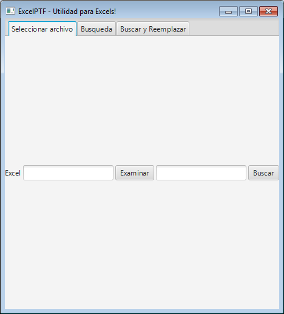
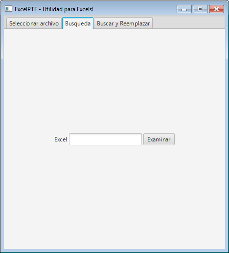
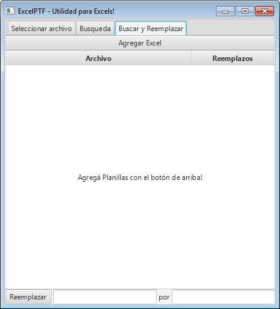

(10. Búsqueda y reemplazo dentro de uno o mas Excels) [<- Atrás](10-buscar-y-reemplazar.md) || [Siguiente ->](12-proceso-personalizado.md) (12. Un proceso Personalizado)  

# 11. Agregando Pestañas a la aplicación

Recordemos lo que nos propusimos:  
1. Crear una interfaz sencilla que nos permita seleccionar un Excel que esté en nuestra computadora. **(HECHO!)**  
2. Vamos a buscar alguna palabra o número dentro del Excel e informar su ubicación. **(HECHO!)**  
3. Vamos a reemplazar una palabra por otra dentro de uno o mas Excels. **(HECHO!)**  
4. **Agregar Pestañas a la aplicación, para que las distintas partes coexistan.**  
5. Vamos a seleccionar un Excel y hacerle todas unas modificaciones y adaptarlo para que otro programa lo pueda leer.  

Ahora vamos por el punto 4!  

Agregaremos pestañas a nuestra aplicación, para tener disponibles todas las funcionalidades anteriormente programadas:  
  
  
  

## Creamos **PanelPestanias**  

Para esto, vamos a crear un panel que muestre las tres pestañas y contenga a los otros paneles hechos anteriormente.  

Tal panel lo llamaremos **PanelPestanias**:  

```java  
package application;

import javafx.scene.control.Tab;
import javafx.scene.control.TabPane;
import javafx.scene.layout.Pane;
import javafx.stage.Stage;

public class PanelPestanias extends TabPane{

}
```  

Hacemos que extienda de **TabPane**. **TabPane** es el panel que provee JavaFX que maneja pestañas. ("Tab" en ingles es Pestaña, y "Pane" Panel)

Al hacer que nuestro panel **PanelPestanias** herede de **TabPane**, incorpora todas sus características y funcionamiento, haciendo que nuestro panel sea ahora un panel con posibilidad de agregar pestañas.  

### Declaración de los Paneles anteriores  

Nuestro panel va a contener a los tres paneles hechos anteriormente:  
1. PanelSeleccionArchivo  
2. PanelBusqueda  
3. PanelBuscarYReemplazar  

Para que eso suceda, los declaramos dentro de la clase:  
```java  
public class PanelPestanias extends TabPane{

	Stage primaryStage;

	PanelSeleccionArchivo panelSeleccionArchivo;
	PanelBusqueda panelBusqueda;
	PanelBuscarYReemplazar panelBuscarYReemplazar;
  
}
```  

### Constructor y propiedades  

Agregamos el método constructor de la clase, muy similar a los anteriores vistos.  
El constructor llamará a los métodos *aplicarPropiedades* e *inicializarPaneles*.  
```java  
public class PanelPestanias extends TabPane{

	Stage primaryStage;

	PanelSeleccionArchivo panelSeleccionArchivo;
	PanelBusqueda panelBusqueda;
	PanelBuscarYReemplazar panelBuscarYReemplazar;

	public PanelPestanias(Stage primaryStage) {
		this.primaryStage=primaryStage;
		inicializarPaneles();
		aplicarPropiedades();
	}

	private void aplicarPropiedades() {
		//impide que las pestanias tengan la cruz que habilita al usuario a cerrarlas
    setTabClosingPolicy(TabPane.TabClosingPolicy.UNAVAILABLE);
	}
  
}
```  

El método *aplicarPropiedades*, lo único que hace es establecer que las pestañas no se puedan cerrar.  

### *inicializarPaneles*  

Agregamos el método *InicializarPaneles*. Este método va a inicializar cada uno de los paneles, y va a llamar al método *agregarPestania* para cada uno de los Paneles.  

El método *agregarPestania* va a recibir dos parámetros: al panel y al texto que se verá en la pestaña.  

```java  
	private void inicializarPaneles() {
		panelSeleccionArchivo = new PanelSeleccionArchivo(primaryStage);
		agregarPestania(panelSeleccionArchivo, "Seleccionar archivo");

		panelBusqueda = new PanelBusqueda(primaryStage);
		agregarPestania(panelBusqueda, "Busqueda");
		
		panelBuscarYReemplazar = new PanelBuscarYReemplazar(primaryStage);
		agregarPestania(panelBuscarYReemplazar, "Buscar y Reemplazar");
	}
```  

### *agregarPestania*  

El método *agregarPestania* es el mas interesante de esta clase. Crea un objeto *tab* del tipo **Tab** para cada Panel que recibe.  

La clase **Tab** es la que representa una pestaña dentro de un **TabPane**.  

Entonces, para cada panel, creamos una **Tab**, le asignamos el texto que se verá en la misma, le asignamos que el contenido sea el Panel y finalmente, agregamos la **Tab** a las Tabs de nuestro **TabPane**.  

```java  
	private void agregarPestania(Pane panel, String nombrePestania) {
		Tab tab = new Tab();
		tab.setText(nombrePestania);
		tab.setContent(panel);
		getTabs().add(tab);
	}
```  

## Código completo de **PanelPestanias**  
Podes descargar el código completo de [acá](sources/ExcelPFT_8.zip).  

```java  
package application;

import javafx.scene.control.Tab;
import javafx.scene.control.TabPane;
import javafx.scene.layout.Pane;
import javafx.stage.Stage;

public class PanelPestanias extends TabPane{

	Stage primaryStage;

	PanelSeleccionArchivo panelSeleccionArchivo;
	PanelBusqueda panelBusqueda;
	PanelBuscarYReemplazar panelBuscarYReemplazar;

	public PanelPestanias(Stage primaryStage) {
		this.primaryStage=primaryStage;
		inicializarPaneles();
		aplicarPropiedades();
	}

	private void aplicarPropiedades() {
		//impide que las pestanias tengan la cruz que habilita al usuario a cerrarlas
        setTabClosingPolicy(TabPane.TabClosingPolicy.UNAVAILABLE);
	}

	private void inicializarPaneles() {
		panelSeleccionArchivo = new PanelSeleccionArchivo(primaryStage);
		agregarPestania(panelSeleccionArchivo, "Seleccionar archivo");

		panelBusqueda = new PanelBusqueda(primaryStage);
		agregarPestania(panelBusqueda, "Busqueda");
		
		panelBuscarYReemplazar = new PanelBuscarYReemplazar(primaryStage);
		agregarPestania(panelBuscarYReemplazar, "Buscar y Reemplazar");
	}

	private void agregarPestania(Pane panel, String nombrePestania) {
		Tab tab = new Tab();
		tab.setText(nombrePestania);
		tab.setContent(panel);
		getTabs().add(tab);
	}

}
```  

# [Indice](../README.md#indice)  
(10. Búsqueda y reemplazo dentro de uno o mas Excels) [<- Atrás](10-buscar-y-reemplazar.md) || [Siguiente ->](12-proceso-personalizado.md) (12. Un proceso Personalizado)  
