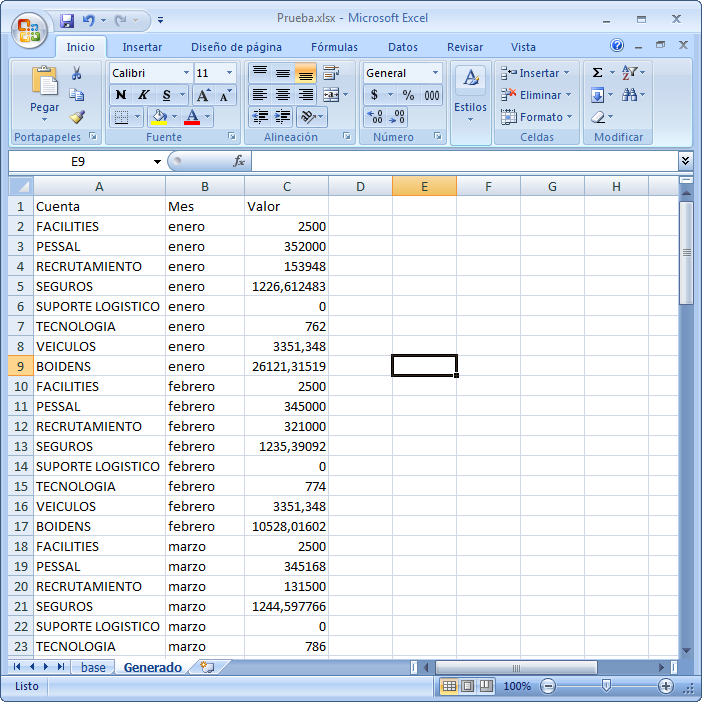

(11. Unificando la Interfaz con Pestañas) [<- Atrás]((11-pestanas.md))  

# 12. Un proceso personalizado!  

Recordemos lo que nos propusimos:  
1. Crear una interfaz sencilla que nos permita seleccionar un Excel que esté en nuestra computadora. **(HECHO!)**  
2. Vamos a buscar alguna palabra o número dentro del Excel e informar su ubicación. **(HECHO!)**  
3. Vamos a reemplazar una palabra por otra dentro de uno o mas Excels. **(HECHO!)**  
4. Agregar Pestañas a la aplicación, para que las distintas partes coexistan.**(HECHO!)**  
5. **Vamos a seleccionar un Excel y hacerle todas unas modificaciones y adaptarlo para que otro programa lo pueda leer.**  

Ahora vamos por el último punto!  

## Que vamos a hacer?  

Un conocido me comentó que en su trabajo había una tarea que repetía siempre. La verdad no entendí bien todo el proceso, pero lo que si me quedó es que siempre recibía un Excel con unas cuentas en una columna, y después valores gastados de esas cuentas en distintas columnas según los meses:  
  

Y la tarea que mi conocido tenía que hacer, siempre igual, era pasar todos esos datos a una tabla larga de tres columnas, en una pestaña distinta:  
  

Aproveché que iba a hacer este tutorial, y le agregué un proceso en la aplicación que le hace la tarea automáticamente:  
  

Hay miles de variantes igualmente. Nuestra aplicación va a pedirle al usuario que ingrese la primer celda y la última, para facilitarnos la cosa.  
Mas adelante podríamos agregarle que detectara automáticamente donde es que la tabla comienza y termina.  
También, mas adelante podríamos hacer que se tomen muchos Excels a la vez, como en la pantalla **Buscar y reemplazar**.  

## Creamos **PanelProcesoPersonalizado**  

El código del nuevo panel es muy similar a los anteriores.  

A ver si pueden entenderlo solos esta vez :)  (cualquier duda consultalo con tu mentor):  

```java  
package application;

import java.io.File;
import java.io.IOException;

import javafx.geometry.Pos;
import javafx.scene.Scene;
import javafx.scene.control.Button;
import javafx.scene.control.Label;
import javafx.scene.control.TextField;
import javafx.scene.layout.GridPane;
import javafx.scene.paint.Color;
import javafx.stage.FileChooser;
import javafx.stage.Stage;

public class PanelProcesoPersonalizado extends GridPane{

	Label textoRuta;
	TextField rutaArchivo;
	Button botonArchivo;

	Label textoInicio;
	TextField inicio;
	Label textoFin;
	TextField fin;

	Button botonProcesar;

	Label textoExplicativo;
  
	Stage primaryStage;

	public PanelProcesoPersonalizado(Stage primaryStage) {
		this.primaryStage=primaryStage;

		inicializarComponentes();
		aplicarPropiedades();
		crearHandlers();	
	}

	private void aplicarPropiedades() {
		setAlignment(Pos.CENTER);
		setHgap(5);
	  setVgap(5);
	}

	private void inicializarComponentes() {
		textoRuta = new Label("Archivo:");
		rutaArchivo = new TextField();
		botonArchivo = new Button("Examinar");

		textoInicio = new Label("Celda inicial:");
		inicio = new TextField();
		inicio.setMaxWidth(40);


		textoFin = new Label("Celda final:");
		fin = new TextField();
		fin.setMaxWidth(40);

		botonProcesar = new Button("Procesar!");
		botonProcesar.setStyle("-fx-base: green;");

		textoExplicativo = new Label("\nSeleccione la planilla con el botón Examinar.\n\nEn \"Celda inicial\" se debe colocar la coordenada de la primer celda superior izquierda. Ejemplo: A1.\nEn \"Celda final\" se debe colocar la coordenada de la última celda inferior derecha. Ejemplo: F10.\n\nPara iniciar, presionar sobre Procesar!");
		textoExplicativo.setWrapText(true);
		textoExplicativo.setMaxWidth(300);
		textoExplicativo.setTextFill(Color.GRAY);

		add(textoRuta, 0, 0);
		add(rutaArchivo, 1, 0, 3, 1);
		add(botonArchivo, 5, 0);

		add(textoInicio, 0, 1);
		add(inicio, 1, 1);

		add(textoFin, 2, 1);
		add(fin, 3, 1);

		add(botonProcesar, 5, 1);

		add(textoExplicativo, 0, 2, 6, 1);

	}

	private void crearHandlers() {
		botonArchivo.setOnAction(e -> seleccionarArchivo());

        botonProcesar.setOnAction(e -> procesar());
	}

	private void seleccionarArchivo() {
		FileChooser selectorDeArchivo = new FileChooser();
		selectorDeArchivo.setTitle("Abri el archivo Excel");

		File archivoSeleccionado = selectorDeArchivo.showOpenDialog(primaryStage);

		if (archivoSeleccionado != null) {
			String ruta = archivoSeleccionado.getAbsolutePath();
			rutaArchivo.setText(ruta);
		}
	}

	private void procesar() {
		String colInicio = inicio.getText(0, 1);
		int filaInicio = Integer.parseInt(inicio.getText(1, inicio.getLength()));


		String colFin = fin.getText(0, 1);
		int filaFin = Integer.parseInt(fin.getText(1, fin.getLength()));

		try {
			ExcelHelper.procesoPersonalizado(rutaArchivo.getText(), colInicio, colFin, filaInicio-1, filaFin-1);
		} catch (IOException e) {
			rutaArchivo.setText("ERROR!");
			e.printStackTrace();
		}

		vaciarCampos();
	}

	private void vaciarCampos() {
		rutaArchivo.setText("");
		inicio.setText("");
		fin.setText("");
	}

}
```  

## Creamos el método del proceso en el **ExcelHelper**  

En **ExcelHelper** agregamos el método que va a usar nuestro nuevo módulo:  

```java  
	public static void procesoPersonalizado(String rutaArchivo, String colInicio, String colFin, int filaInicio, int filaFin) throws IOException{

		FileInputStream archivo = new FileInputStream(new File(rutaArchivo));

		XSSFWorkbook planilla = new XSSFWorkbook (archivo);

		XSSFSheet hoja = planilla.getSheetAt(0);

		List<Cuenta> cuentas = new ArrayList<Cuenta>();
		List<String> meses = new ArrayList<String>();

		int colInicioIndice = CellReference.convertColStringToIndex(colInicio);
		int colFinIndice = CellReference.convertColStringToIndex(colFin);

		int colInicioIndiceAux = colInicioIndice+1;;

		Row fila;

		//obtener meses del encabezado
		fila = hoja.getRow(filaInicio);
		while(colInicioIndiceAux<=colFinIndice){
			String mes = fila.getCell(colInicioIndiceAux).getStringCellValue();
			meses.add(mes);
			colInicioIndiceAux++;
		}

		//obtener cuentas y valores
		filaInicio++;
		while(filaInicio<=filaFin){
			fila = hoja.getRow(filaInicio);
			String nombreCuenta = fila.getCell(colInicioIndice).getStringCellValue();

			Cuenta cuenta = new Cuenta(nombreCuenta);
			cuentas.add(cuenta);

			//obtener valores para la cuenta
			colInicioIndiceAux = colInicioIndice+1;
			while(colInicioIndiceAux<=colFinIndice){
				cuenta.getValores().add(fila.getCell(colInicioIndiceAux).getNumericCellValue());
				colInicioIndiceAux++;
			}

			filaInicio++;
		}

		//escribir nueva hoja con el nuevo formato
		XSSFSheet hojaDestino = planilla.createSheet("Generado");

		//escribir el encabezado
		hojaDestino.createRow(0).createCell(0).setCellValue("Cuenta");
		hojaDestino.getRow(0).createCell(1).setCellValue("Mes");
		hojaDestino.getRow(0).createCell(2).setCellValue("Valor");

		//escribir cada fila con nombre de la Cuenta, mes y valor
		int filaContador=1;

		for(String mes: meses){
			for(Cuenta cuenta: cuentas){
				fila = hojaDestino.createRow(filaContador);
				fila.createCell(0).setCellValue(cuenta.getNombre());
				fila.createCell(1).setCellValue(mes);
				fila.createCell(2).setCellValue(cuenta.getValores().get(meses.indexOf(mes)));
				filaContador++;
			}
		}

		archivo.close();
		FileOutputStream archivoSalida = new FileOutputStream(rutaArchivo);
		planilla.write(archivoSalida);
		planilla.close();

	}
```  
### Creación de clase **Cuenta**  
Como es un proceso un poco mas complejo, creé una clase **Cuenta** para ayudarme:  
```java  
package application;

import java.util.ArrayList;
import java.util.List;

public class Cuenta {

	private String nombre;

	private List<Double> valores;

	public Cuenta(String nombre) {
		super();
		valores = new ArrayList<Double>();
		this.nombre = nombre;
	}

	public String getNombre() {
		return nombre;
	}

	public void setNombre(String nombre) {
		this.nombre = nombre;
	}

	public List<Double> getValores() {
		return valores;
	}

	public void setValores(List<Double> valores) {
		this.valores = valores;
	}

}

```  

## Agregado del nuevo módulo  

No olvidemos que ahora tenemos que agregar este nuevo módulo al **PanelPestanias**:  
```java  
	PanelProcesoPersonalizado panelProcesoPersonalizado;
	
	private void inicializarPaneles() {
		panelSeleccionArchivo = new PanelSeleccionArchivo(primaryStage);
		agregarPestania(panelSeleccionArchivo, "Seleccionar archivo");

		panelBusqueda = new PanelBusqueda(primaryStage);
		agregarPestania(panelBusqueda, "Busqueda");

		panelBuscarYReemplazar = new PanelBuscarYReemplazar(primaryStage);
		agregarPestania(panelBuscarYReemplazar, "Buscar y Reemplazar");

		panelProcesoPersonalizado = new PanelProcesoPersonalizado(primaryStage);
		agregarPestania(panelProcesoPersonalizado, "Proceso personalizado");
	}
```  

## Probar el código  
Para esta prueba, podemos descargar el Excel que yo usé descargándolo de [acá](excels/Original.xlsx).  

## Código completo  
Podes descargar el código completo de [acá](../sources/ExcelPTF_12.zip).  

## Conclusión  

Vieron como, ya teniendo un panel como **PanelPestanias**, y ya teniendo una clase como **ExcelHelper**, agregar nuevos módulos o características a nuestra aplicación es muy fácil y ordenado.  

Solo tenemos que agregar el panel nuevo, agregar una función, si es necesaria, al **ExcelHelper**, y agregar el panel al **PanelPestanias**.  

Se acuerdan cuando vimos [Buenas prácticas](8-MVC.md#buenas-practicas)? Habíamos hablado de tener el código ordenado en distintas clases. Imagínense como sería nuestra aplicación si hiciese lo mismo que hace ahora, pero todo metido en la clase **Main**!  

Por eso, siempre es fundamental tener el código ordenado y separado en distintas clases, según patrones como [MVC](8-MVC.md#mvc), así nosotros mismos y otros pueden entender lo que escribimos y construir fácilmente sobre eso.  

# [Indice](../README.md#indice)  
(11. Unificando la Interfaz con Pestañas) [<- Atrás]((11-pestanas.md))   

