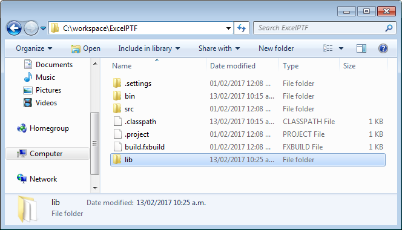
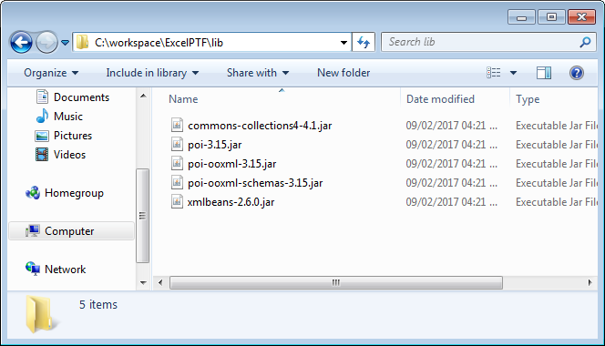
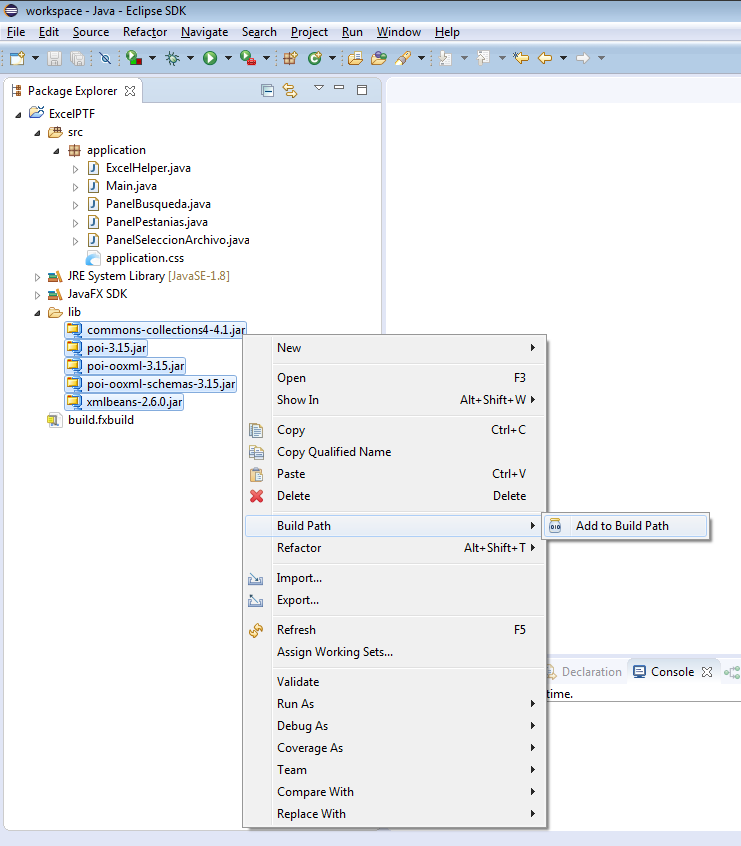
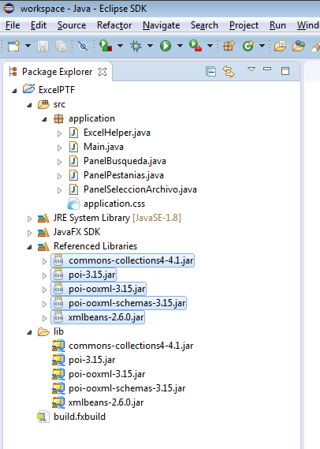
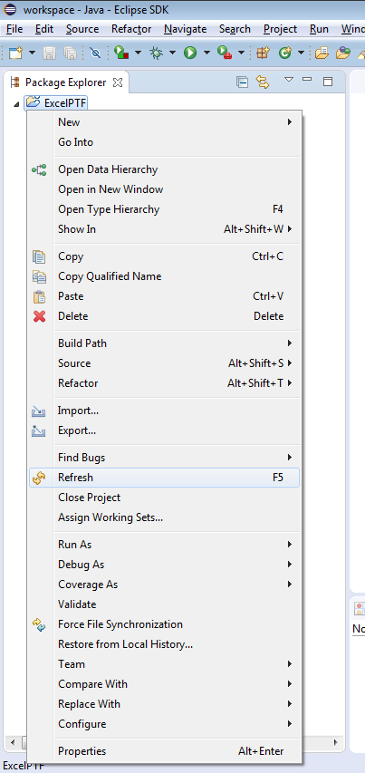
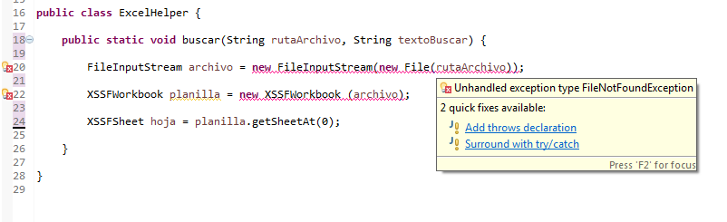
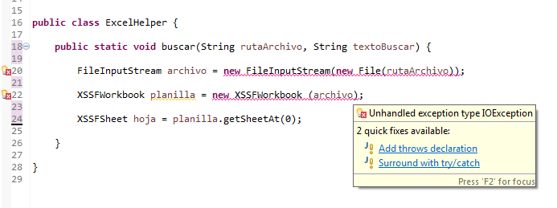
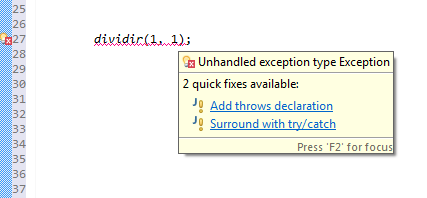
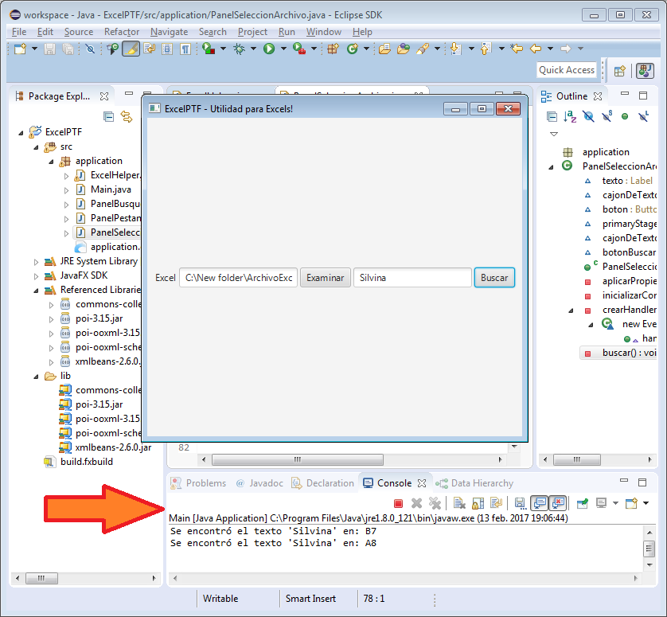

(8. Buenas prácticas) [<- Atrás](8-MVC.md) || [Siguiente ->](10-buscar-y-reemplazar.md) (10. Búsqueda y reemplazo dentro de uno o mas Excels)  

# 9. Búsqueda dentro de un Excel  

Recordemos lo que nos propusimos:  
1. Crear una interfaz sencilla que nos permita seleccionar un Excel que esté en nuestra computadora. **(HECHO!)**  
2. **Vamos a buscar alguna palabra o número dentro del Excel e informar su ubicación.**  
3. Vamos a reemplazar una palabra por otra dentro de uno o mas Excels.  
4. Agregar Pestañas a la aplicación, para que las distintas partes coexistan.  
5. Vamos a seleccionar un Excel y hacerle todas unas modificaciones y adaptarlo para que otro programa lo pueda leer.  

Ya tenemos la ruta donde está el archivo Excel que queremos usar. Ahora nos falta que nuestro programa lo abra.  
Ojo! Como usuario del programa, no vamos a ver la planilla abierta con su contenido. Lo que la aplicación va a hacer es abrirla internamente, para poder acceder a su contenido.  
Una vez que tengamos acceso a su contenido, buscaremos en todas las celdas para ver en cual de ellas se encuentra la palabra a buscar.  

Para eso, también necesitamos que la interfaz tenga un campo de texto en donde poner la palabra a buscar, y otro boton para realizar la búsqueda.  

## Interfaz  

Vamos a hacerlo muy sensillo. A nuestra clase **PanelSeleccionArchivo** le agregamos los siguientes componentes:  
1. Un objeto de tipo **TextField** que llamaremos *cajonDeTextoABuscar*.  
2. Un objeto de tipo **Button** que llamaremos *botonBuscar*.  

Para eso, primero, en la primer parte de la clase **PanelSeleccionArchivo**, en el mismo lugar donde tenemos los demas componentes declarados, agregamos los nuevos:  

```java  
public class PanelSeleccionArchivo extends HBox{

	Label texto;
	TextField cajonDeTexto;
	Button boton;
	Stage primaryStage;
	TextField cajonDeTextoABuscar;
	Button botonBuscar;
  .
  .
  .
```  

Luego, los inicializamos y agregamos al panel. Hacemos esto en el método *inicializarComponentes* que habíamos escrito:  
```java
	private void inicializarComponentes() {
		texto = new Label("Excel");
		getChildren().add(texto);

		cajonDeTexto = new TextField();
		getChildren().add(cajonDeTexto);

		boton = new Button("Examinar");
		getChildren().add(boton);
		
		cajonDeTextoABuscar = new TextField();
		getChildren().add(cajonDeTextoABuscar);
		
		botonBuscar = new Button("Buscar");
		getChildren().add(botonBuscar);
	}
```  
Ejecutamos la aplicación y si nos salió todo perfecto, ya veríamos los nuevos controles:  
  
Puede que la aplicación no sea muy atractiva todavía. Incluso puede ser que las palabras de los botones aparezcan recortadas. No le vamos a dar bola a eso por ahora.  
Mas adelante nos vamos a preocupar por mejorar la estética!  

## Abrir el Excel  

Listo! Ahora ya podemos abrir el excel y hacer la búsqueda.  
Haremos que cuando uno haga click en el botón de Buscar, se abra el Excel y se haga la búsqueda.  
Entonces, arranquemos con el **Handler**!  

### Handler de búsqueda  

Debemos agregar el código del **Handler** para el nuevo *botonBuscar*. Lo haremos en el método *crearHandlers* de la clase **PanelSeleccionadoArchivo** que ya tenemos hecho:  

Pero lo haremos de una forma distinta al anterior. Usaremos algo que se llama "expresión Lambda". Estas expresiones sirven para hacer el código mas córto.  

Comparemos como es el código del **Handler** que habíamos escrito para *boton* y como es el del *botonBuscar* que agregamos ahora:  

```java
	private void crearHandlers() {
		boton.setOnAction(new EventHandler<ActionEvent>() {
		    @Override public void handle(ActionEvent e) {
		    	FileChooser selectorDeArchivo = new FileChooser();
				selectorDeArchivo.setTitle("Abri el archivo Excel");

				File archivoSeleccionado = selectorDeArchivo.showOpenDialog(primaryStage);

				if (archivoSeleccionado != null) {
					String ruta = archivoSeleccionado.getAbsolutePath();
					cajonDeTexto.setText(ruta);
				}
		    }
		});

		botonBuscar.setOnAction(e -> buscar());
		
	}
```  

Que significa? Que cuando uno haga click en el *botonBuscar*, la acción que se disparará será ejecutar el método llamado *buscar*.  
No es mas corto de escribir, cómodo y ordenado? De eso se tratan las buenas prácticas!  

Agreguemos entonces el método *buscar*, para después llenarlo con el código necesario para la búsqueda:  

```java
	private void buscar(){
	
	}	
```  

### Búsqueda  

Dentro del método *buscar* ya podríamos escribir el código necesario para la apertura del archivo y búsqueda. Pero... podríamos ser mas ordenados!  
Imaginemos que nuestra aplicación crece y crece, y ya tiene 20 pantallas, y todas las pantallas acceden a archivos Excel. Y de pronto alguien nos cuenta que hay una forma mejor de abrir los Excel, o que la forma que usábamos no sirve para un tipo nuevo de Excel que acaba de salir. Tendríamos que abrir cada una de las 20 clases y modificarlas una por una con la nueva forma.  
Seguro que en alguno la pifiamos, además de ser un trabajo aburrido y repetitivo...  
Entonces, que hacemos? Otra vez, ordenamos y separamos las cosas en otra clase.  

### ExcelHelper  

Vamos a crear una clase que llamaremos **ExcelHelper**. Le podemos poner el nombre que queramos, pero le ponemos así porque es una clase que nos va a ayudar (help en ingles) en todo lo que necesitemos hacer con Excels.  
La creamos:  

```java
package application;

public class ExcelHelper {

	
}
```  

Ahora, creamos un método que va a ser el encargado de buscar:

```java
package application;

public class ExcelHelper {

	public static void buscar(String rutaArchivo, String textoBuscar){

	}
	
}
```  
Al método lo llamamos *buscar*, y le pasamos como argumentos la *rutaArchivo* y el *textoBuscar*.  

#### Descargamos Apache POI  

Ahora, dentro de ese método *buscar* que creamos, vamos a poner el código que abre y busca dentro del Excel.  
Al comienzo habíamos hablado sobre la librería Apache POI. Esa es la librería que nos va a ayudar a hacer facil todas las operaciones con Excel.  
La descargamos de https://poi.apache.org/download.html. Buscamos los **binarios** de la última versión **Estable**.  
Los **binarios** son los archivos de la librería listos para usar. Hay veces que uno quiere ver mas a fondo como funciona la librería, o modificarla por alguna razón en particular. Cuando queremos hacer alguna de esas dos, en vez de descargar los **binarios** descargamos los **fuentes**. Los **fuentes** contienen todo el código hecho para la librería.  
Como nosotros solo queremos usar la librería, descargamos los **binarios** unicamente. No nos intereza por ahora tener las **fuentes**.  
**Estable** significa que descargamos la última versión de la librería que ya está bien probada y se sabe que funciona bien. Las versiones **beta**, por ejemplo, son versiones mas nuevas, pero que todavía no se probaron bien, por lo que podrían tener fallas.  
Así que, como regla general, a menos que uno necesite alguna caracteristica muy nueva, generalmente vamos a preferir las versiones **estables** que ya están bien probadas así estamos seguros de que nos va a funcionar bien sin errores.  

La página está en Ingles, así que si tenes alguna duda al bajar la librería, consultale a tu mentor.  
Para el momento en el que hice esta Guía, la versión **estable** que había y descargué fue la **3.15**.  

#### Agregamos Apache POI a nuestro proyecto  

Una vez que se descargó la librería, la tenemos que agregar a nuestro proyecto. En mi caso, descargué el siguiente archivo:  
- poi-bin-3.15-20160924.zip  

Lo descomprimo y dentro veo los siguientes archivos:  
1. **poi-3.15.jar**  
2. poi-examples-3.15.jar  
3. poi-excelant-3.15.jar  
4. **poi-ooxml-3.15.jar**  
5. **poi-ooxml-schemas-3.15.jar**  
6. poi-stratchpad-3.15.jar  
7. lib / commons-codec-1.10.jar  
8. **lib / commons-collections4-4.1.jar**  
9. lib / commons-logging-1.2.jar  
10. lib / junit-4.12.jar  
11. lib / log4j-1.2.17.jar  
12. ooxml-lib / curvesapi-1.04.jar  
13. **ooxml-lib / xmlbeans-2.6.0.jar**  

Cada archivo terminado en ".jar" es una librería.  

¿Por que son tantas? Porque, al igual que nosotros en nuestro proyecto buscamos tener todo ordenado, y separamos entonces el código en distintos archivos, así lo hacen los creadores (el grupo Apache) de esta librería.  
Y, por ejemplo, los librerías que están dentro de la carpeta *lib*, son otras librerías aparte, que la librería ApachePOI necesita para funcionar. De la misma forma que para nuestro proyecto nosotros importamos la librería ApachePOI, la librería ApachePOI importa las otras librerías.  
Es como una cadena de colaboración! Quizá en otro momento alguien necesite parte de el código que nosotros estamos creando en esta Guía, y lo agregue a su proyecto!  

Las librerías resaltadas en **negrita** son las que vamos a *importar*(agregar) a nuestro proyecto. Ante la duda, siempre podemos agregar todas. Pero para lo que nosotros vamos a hacer, solo necesitamos las resaltadas.  

Si, por ejemplo, nos olvidáramos de importar la librería **commons-ocllections4-4.1.jar**, al correr la aplicación y llegar a la parte del código en la cual esa librería se necesite, obtendríamos un error similar al siguiente:  

```java  
Exception in thread "JavaFX Application Thread" java.lang.NoClassDefFoundError: org/apache/commons/collections4/ListValuedMap
```  

El error indica "NoClassDefFoundError". Significaría "Erro por Definicion de Clase No Encontrada". Quiere decir que necesita usar la clase **org/apache/commons/collections4/ListValuedMap** y no la tiene disponible.  
Como se la hacemos disponible al programa? Importando la librería **commons-ocllections4-4.1.jar**.  

##### Carpeta **lib**  

Ahora, vamos a la carpeta de nuestro proyecto y creamos la carpeta lib. En ella guardaremos las librerías que necesitemos:  
  

##### Copiamos las librerías  
Las librerías que habíamos resaltado anteriormente, las copiamos y pegamos en la carpeta **lib**:
  

##### Build Path  
Ahora solo falta indicarle al proyecto que tiene que tomar las librerías que acabamos de dejar en la carpeta. Eso lo hacemos agregándolas al **Build Path**.  
El **Build Path** es donde se guardan todas las **rutas** de las librerías con las que la aplicación cuenta.  
Para agregar las librerías que descargamos al **Build Path** de nuestra aplicación, dentro del Eclipse, les damos click derecho y **Build Path / Add to Build Path**.  
  
Se agregarán las librerías y las verás también dentro de **Referenced Librarías** (Librerías referenciadas):  
  

Si ya tenías abierto el Eclipse cuando creaste la carpeta **lib** y agregaste las librerías, puede que todavía no las veas en el proyecto dentro del Eclipse. Si es el caso, podes dar click derecho en el proyecto y darle a **Refresh**:  
  

#### Imports  

A nuestra clase **ExcelHelper** le agregamos los *imports* de las clases que vamos a usar:  

```java  
package application;

import java.io.File;
import java.io.FileInputStream;
import java.io.IOException;

import org.apache.poi.ss.usermodel.Cell;
import org.apache.poi.ss.usermodel.CellType;
import org.apache.poi.ss.usermodel.Row;
import org.apache.poi.ss.util.CellReference;
import org.apache.poi.xssf.usermodel.XSSFSheet;
import org.apache.poi.xssf.usermodel.XSSFWorkbook;

public class ExcelHelper {

	public static void buscar(String rutaArchivo, String textoBuscar){

	}
	
}
```  
**(Mas adelante veremos como hacer cuando no sabemos cuales Imports vamos a necesitar)**  

#### Abrir el Excel  

Llenamos el método *buscar* con el código necesario para abrir la planilla:  
```java
	public static void buscar(String rutaArchivo, String textoBuscar){

		FileInputStream archivo = new FileInputStream(new File(rutaArchivo));
		
		XSSFWorkbook planilla = new XSSFWorkbook (archivo);		
		
		XSSFSheet hoja = planilla.getSheetAt(0);
		
	}
```  
En la primer linea dentro del método abrimos el archivo, basándonos en la ruta que se le pasa por parámetro al método: *rutaArchivo*. Eso lo asignamos a la variable *archivo*.  

Después, para leer ese archivo como un Excel, creamos el objeto *planilla* del tipo **XSSFWorkbook** (Workbook en ingles es libro/cuaderno de trabajo) pasándole al constructor el *archivo*.  

Para acceder a la primer hoja dentro del Excel, creamos el objeto *hoja* del tipo **XSSFSheet** (Sheet en ingles es Hoja) usando el método *getSheetAt* de la *planilla*, que recibe el número de la hoja que debe entregar. En nuestro caso, 0 (cero), refiere a la primera.  

##### Exceptions  

Con el código anterior que escribimos en el método buscar, vamos a ver que el Eclipse nos marca con error las dos primeras lineas.  
Si ponemos el mouse sobre los dos errores, vemos la sugerencia que Eclipse nos da acerca del error:  
Primera:  
  
Segunda:  
  

Ambas dicen "Unhandled exception type..." ("Excepción no manejada del tipo..." en ingles).  

En Java, los errores se llaman *Exceptions*. Y Java tiene una característica muy importante que se llama "Manejo de Exceptions".  
Los lenguajes que no tienen esa característica, cuando ocurre un error, la aplicación se paraliza o se cierra. Eso arruina todo lo que la aplicación o el usuario estaban haciendo.  

Seguramente te ha pasado en algún momento estar trabajando en algún documento, escribiendo algún texto, informe, jugando a un juego, etc., y de pronto por un error se cierra la aplicación, programa o juego, y perdiste todo lo que habías hecho. Eso pasa porque la aplicación, programa o juego no tiene manejo de Excepciones, o tiene un manejo pobre.  

Este "manejo de excepciones" funciona de la siguiente forma: hay cosas que los diseñadores del lenguaje y librerías mas importantes saben que pueden fallar. Por ejemplo: no es posible dividir por 0 (cero). Entonces, imaginemos que una persona crea el siguiente método:   
```java
	public static void dividir(int primerNumero, int segundoNumero){
		int resultado = primerNumero / segundoNumero;
		//hacer algo con el resultado...
	}
```  
El método anterior va a funcionar perfecto siempre que *segundoNumero* no sea 0. Si alguna parte de la aplicación llama a ese método pasando como parámetro de *segundoNumero* el valor 0, entonces se va a generar el siguiente error:  

```java  
Exception in thread "main" java.lang.ArithmeticException: / by zero
```  
Entonces podemos hacer dos cosas:  
1. Le indicamos al método que escribimos que debe hacer en el caso de que suceda esa **Exception**.  
2. Indicamos en el método que puede ocurrir esa **Exception**, de modo que las partes de la aplicación que lo usen, decidan que hacer en caso de que suceda.  

La primer solución es la que ya habíamos usado [antes](4-codigo-por-defecto.html#try--catch): el **Try/Catch**:  
```java
	public static void dividir(int primerNumero, int segundoNumero){
	
		try{
			int resultado = primerNumero / segundoNumero;
			//hacer algo con el resultado...
		} catch(ArithmeticException e){
			//si se ejecuta el código que se pone acá, es porque la operación anterior falló.  
			//acá podemos informar el error al usuario y guardar todo lo que haya hecho para que no se pierda,  
			//o pedirle que ingrese un nuevo valor para segundoNumero.  
		}
		
	}
```  

La segunda solución es la que vamos a usar en este caso:  
```java
	public static void dividir(int primerNumero, int segundoNumero) throws Exception{
		int resultado = primerNumero / segundoNumero;
		//hacer algo con el resultado...
	}
```  
Entonces, con esta forma, si otra parte de la aplicación quiere llamar al método sin usar **Try/Catch**, va a pasar lo siguiente:  

  
El Eclipse, o IDE que se esté usando, va a avisar que es necesario usar un **Try/Catch** por si sucede un error, para "manejar" el error y hacer lo que sea necesario para continuar sin mayor problema.  
Si no hacemos eso, si llega a haber un cero en la variable segundoNumero, el programa va a fallar y cerrarse, perdiéndose todo lo que no se haya guardado.  

##### Nuestro caso  
En nuestro caso, los que escribieron el código de **FileInputStream** y **XSSFWorkbook** saben que puede haber un error si la *rutaArchivo* que se pasa es incorrecta. Imaginemos que en vez de pasar la ruta real del archivo pasamos un texto cualquiera. Va a fallar!  

Por eso, nos obligan a manejar la *IOException* (Exception de Entrada/Salida), que es una Excepción que se da cuando hay un error leyendo o escribiendo archivos.  
Modificamos el método *buscar* agregándole el "throws" de la Exception, para que el que decida que hacer en caso de error no sea **ExcelHelper**, sino la parte de la aplicación que la use:  
```java  
	public static void buscar(String rutaArchivo, String textoBuscar) throws IOException{

		FileInputStream archivo = new FileInputStream(new File(rutaArchivo));

		XSSFWorkbook planilla = new XSSFWorkbook (archivo);

		XSSFSheet hoja = planilla.getSheetAt(0);
	
	}
```  

#### Recorrer todas las celdas  

Ahora que ya tenemos la *hoja* del Excel, vamos a leer cada una de las celdas, para ver si en algúna está la palabra que buscamos.  
Lo haremos de la siguiente forma:  
1. Vamos a la primer fila.  
2. Recorremos todas las celdas de la primer fila.  
3. Vamos a la segunda fila.  
4. Recorremos todas las celdas de la segunda fila.  
5. Vamos a la tercer fila.  
6. Recorremos todas las celdas de la tercer fila.  
7. Repetimos para todas las filas que hayan.  

##### Recorrer todas las filas  

Eso lo vamos a hacer con el uso de **for** ("para" en ingles). Escribimos lo siguiente:

```java  
	public static void buscar(String rutaArchivo, String textoBuscar) throws IOException{

		FileInputStream archivo = new FileInputStream(new File(rutaArchivo));

		XSSFWorkbook planilla = new XSSFWorkbook (archivo);

		XSSFSheet hoja = planilla.getSheetAt(0);

		for (Row fila : hoja) {

	    	}
		
	}
```  
Ese código va a crear un objeto llamado *fila*, del tipo **Row** (fila en ingles), para cada fila dentro de la *hoja*.  

Es un bucle iterativo. Esto significa que el **for** va a crear el primer objeto llamado *fila* para la primer fila del Excel. Luego ejecutará todo el código dentro de las llaves para esa fila. Luego, toma la segunda fila y la asigna a *fila* y vuelve a ejecutar el código dentro de las llaves, ahora con la segunda fila dentro de la variable *fila*.  
Y así, infinitamente, hasta que se hayan recorrido todas las filas de *hoja*.  

##### Recorrer todas las celdas de la fila  

Ahora, para cada *fila*, recorremos todas las celdas:  

```java  
		for (Row fila : hoja) {
	        	for (Cell celda : fila) {
	            		
	        	}
	    	}
```  

Análogamente, hacemos otro **for**. En este **for** recorremos cada *celda* del tipo **Cell** que se encuentra en la *fila*.  
Lo que hicimos fue agregar otro bucle dentro del bucle anterior. Entonces, para cada *fila*, se van a buscar todas las celdas que contiene, y una por una, bajo la variable *celda* se va a ejecutar el código dentro de las nuevas llaves.  

#### Reconocer el contenido de la Celda  

Como ya sabemos, los Excels pueden contener muchos tipos de datos distintos. En una celda pueden haber:  
1. Letras  
2. Números  
3. Fechas  
4. Formulas  
5. Etc...  

Por eso, antes de apurarnos a ver si el contenido de la Celda coincide que la palabra que queremos buscar, vamos a fijarnos cual es el Tipo del contenido. Nos vamos a fijar si el contenido es una cadena de caracteres. Las cadenas de caracteres pueden ser nombres, palabras, frases, etc. (texto, básicamente). En Java, ese tipo de dato (cadena de caracteres) se llama **String**.  

El código:  

```java  
	for (Row fila : hoja) {
	        for (Cell celda : fila) {

			if (celda.getCellTypeEnum() == CellType.STRING) {
		    
			}
			
	 	}
	}	
```  
Mediante el método **getCellTypeEnum** de *celda*, obtenemos el Tipo de dato de la celda. Lo comparamos con el tipo **CellType.STRING**.  
Si es igual, significa que la celda tiene una cadena de caracteres dentro, y se ejecutará lo que escribamos dentro de las llaves.  

#### Comparar contenido de la Celda  

Cuando ya sabemos que la celda tiene una String (o sea, una cadena de caracteres), nos fijamos si dicho String coincide con lo que estamos buscando, que viene en la variable *textoBuscar*.  

```java  
	for (Row fila : hoja) {
		for (Cell celda : fila) {
			if (celda.getCellTypeEnum() == CellType.STRING) {
			
				if (celda.getStringCellValue().contains(textoBuscar)) {
				
				}
				
			}
		}
	}

```  
Primero, con el método **getStringCellValue** de *celda*, obtenemos el String que está dentro de la celda.  
Luego, con el método **contains** de *String*, nos fijamos si el String de la celda contiene el texto dentro de *textoBuscar*.  

El método **contains** se fija si el String contiene a lo que buscamos. Es decir, que si buscamos la palabra "hola" dentro de los siguientes Strings, todos van a ser correctos:  
1. "hola"  
2. "hola lalala"  
3. "jojojo hola jejeje"  
4. "jojojo hola"  
5. "jwqeiovjdwholahiaosdks"  
6. "holaaaaaaaaa"  

#### Obtener fila y columna de la Celda  

Si ya detectamos que la Celda contiene el texto *textoBuscar* que estamos buscando, entonces ya podemos detectar cual es su fila y columna, para luego informarlo:

```java  
	for (Row fila : hoja) {
		for (Cell celda : fila) {
			if (celda.getCellTypeEnum() == CellType.STRING) {			
				if (celda.getStringCellValue().contains(textoBuscar)) {
				
					int filaEncontrada = celda.getRowIndex() + 1;
					
					int columnaEncontrada = celda.getColumnIndex();
					String columnaEncontradaLetra = CellReference.convertNumToColString(columnaEncontrada);		
					
				}				
			}
		}
	}
```  
Con el método **getRowIndex** de *celda* obtenemos el número de fila de la celda, y lo guardamos en *filaEncontrada*. Nótese que le sumamos 1 a ese valor. Esto lo hacemos porque para Java, la primer fila no es la fila 1, sino la fila 0. Si tenes dudas sobre esto, consultalo con tu mentor!  

Después, con el método **getColumnIndex** de *celda* obtenemos el número de la columna de la celda. Pero eso no nos conforma... porque el número de la columna es un número, y nosotros en Excel acostumbramos a llamar a las columnas con letras. 
Por eso, con el método **convertNumToColString** de la clase de ayuda **CellReference** convertimos el número a la létra que representa. Esa letra la guardamos en la variable *columnaEncontradaLetra* del tipo **String**.  

Cuando tengamos esta parte terminad, volvé a este código y probá modificarlo para ver cuales son los valores de:  
1. filaEncontrada  
2. filaEncontrada + 1  
3. columnaEncontrada  
4. columnaEncontradaLetra  

#### Mostrar el resultado obtenido  

Ahora que ya encontramos la fila y columna para cada *celda* que contenga nuestro *textoBuscar*, vamos a mostrarlo.  

Lo ideal sería mostrarlo en la aplicación misma, en una tablita o mediante algún mensaje. Pero eso lo haremos después.  

##### La **consola**  

Ahora vamos a usar la **consola**. La consola es una parte en la que la aplicación puede escribir texto, fuera de la ventanita de la interfaz. A menos que un usuario sepa como abrirla, se encuentra oculta.

Para que sirve esto? Imaginemos que nuestra aplicación muestra un listado de usuarios pero, en la mitad, por alguna razón, sucede un error. La ventana de la aplicación quizá muestre únicamente el mensaje de "Error", o diga algo como "Se produjo un error, contacte a soporte".  

Eso al usuario le da un mensaje claro y suficiente. Pero si la aplicación la estamos usando o probando nosotros... no nos dice nada sobre lo que pasó realmente! Nosotros vamos a querer mas detalle, con toda la información sobre el error en particular.  

Ese detalle lo podemos volcar en la consola, y cuando veamos que algo no funciona bien, chequearla para verlo. Imaginate si al usuario le mostramos el error que habíamos citado previamente [Descargamos Apache POI](#descargamos-apache-poi). No entendería nada!  

Como escribimos en la consola? Así:     

```java  
	for (Row fila : hoja) {
		for (Cell celda : fila) {
			if (celda.getCellTypeEnum() == CellType.STRING) {			
				if (celda.getStringCellValue().contains(textoBuscar)) {				
					int filaEncontrada = celda.getRowIndex() + 1;					
					int columnaEncontrada = celda.getColumnIndex();
					String columnaEncontradaLetra = CellReference.convertNumToColString(columnaEncontrada);		
					
					String mensaje = "Se encontró el texto '"+textoBuscar+"' en: "+columnaEncontradaLetra+filaEncontrada;

					System.out.println(mensaje);					
				}				
			}
		}
	}

```  
Primero creamos el texto que queremos mostrar y lo guardamos en la variable *mensaje*.  

Luego llamamos al método **println** de *System.out* y le pasamos el *mensaje* como argumento.  


#### Código del ExcelHelper  

Luego del **for** principal, cerramos la planilla y archivo, ya que no lo usaremos mas.  

Entonces nuestra clase **ExcelHelper** queda de la siguiente forma:

```java  
package application;

import java.io.File;
import java.io.FileInputStream;
import java.io.IOException;

import org.apache.poi.ss.usermodel.Cell;
import org.apache.poi.ss.usermodel.CellType;
import org.apache.poi.ss.usermodel.Row;
import org.apache.poi.ss.util.CellReference;
import org.apache.poi.xssf.usermodel.XSSFSheet;
import org.apache.poi.xssf.usermodel.XSSFWorkbook;

public class ExcelHelper {

	public static void buscar(String rutaArchivo, String textoBuscar) throws IOException{
	
		FileInputStream archivo = new FileInputStream(new File(rutaArchivo));
		XSSFWorkbook planilla = new XSSFWorkbook (archivo);
		XSSFSheet hoja = planilla.getSheetAt(0);

		for (Row fila : hoja) {
			for (Cell celda : fila) {
	            		if (celda.getCellTypeEnum() == CellType.STRING) {
	                		if (celda.getStringCellValue().contains(textoBuscar)) {
	                			int filaEncontrada = celda.getRowIndex()+1;
	                			int columnaEncontrada = celda.getColumnIndex();
	                			String columnaEncontradaLetra = CellReference.convertNumToColString(columnaEncontrada);
	                    			String mensaje = "Se encontró el texto '"+textoBuscar+"' en: "+columnaEncontradaLetra+filaEncontrada;

	                    			System.out.println(mensaje);
	                		}
	            		}
	        	}
	    	}

		planilla.close();
		archivo.close();
		
	}

}
```  

### Llamada al **ExcelHelper** desde **PanelSeleccionArchivo**  

Ahora que ya tenemos listo el **ExcelHelper**, solo queda llamarlo desde la clase **PanelSeleccionArchivo**:  
```java  

	private void buscar(){
		try {
			ExcelHelper.buscar(cajonDeTexto.getText(), cajonDeTextoABuscar.getText());
		} catch (IOException e) {
			System.out.println("Hubo un error!");
			e.printStackTrace();
		}
	}
```  
Recordemos que es necesario usar el **Try/Catch** como vimos ya en el paso [anterior](#exceptions).  

### Probamos el código  

#### Excel de prueba  

Para esta prueba simple, podemos descargar el Excel que yo usé descargándolo de [acá](excels/ArchivoExcel.xlsx).  

#### Corremos el programa  

Corremos el programa, seleccionamos el archivo y buscamos algunos de los nombres.  

Para ver si el resultado que escribimos en la consola sale correctamente, vamos al Eclipse y en la parte inferior abrimos la pestaña **Console**.  

Ahí deberíamos ver el resultado:  
  

### Código completo  
Podes descargar el código completo de [acá](../sources/ExcelPTF_9.zip).  

#### ExcelHelper  

```java  
package application;

import java.io.File;
import java.io.FileInputStream;
import java.io.IOException;

import org.apache.poi.ss.usermodel.Cell;
import org.apache.poi.ss.usermodel.CellType;
import org.apache.poi.ss.usermodel.Row;
import org.apache.poi.ss.util.CellReference;
import org.apache.poi.xssf.usermodel.XSSFSheet;
import org.apache.poi.xssf.usermodel.XSSFWorkbook;

public class ExcelHelper {

	public static void buscar(String rutaArchivo, String textoBuscar) throws IOException{
	
		FileInputStream archivo = new FileInputStream(new File(rutaArchivo));
		XSSFWorkbook planilla = new XSSFWorkbook (archivo);
		XSSFSheet hoja = planilla.getSheetAt(0);

		for (Row fila : hoja) {
			for (Cell celda : fila) {
	            		if (celda.getCellTypeEnum() == CellType.STRING) {
	                		if (celda.getStringCellValue().contains(textoBuscar)) {
	                			int filaEncontrada = celda.getRowIndex()+1;
	                			int columnaEncontrada = celda.getColumnIndex();
	                			String columnaEncontradaLetra = CellReference.convertNumToColString(columnaEncontrada);
	                    			String mensaje = "Se encontró el texto '"+textoBuscar+"' en: "+columnaEncontradaLetra+filaEncontrada;

	                    			System.out.println(mensaje);
	                		}
	            		}
	        	}
	    	}

		planilla.close();
		archivo.close();
		
	}

}
```  
#### PanelSeleccionArchivo  

```java  
package application;

import java.io.File;
import java.io.IOException;

import javafx.event.ActionEvent;
import javafx.event.EventHandler;
import javafx.geometry.Pos;
import javafx.scene.control.Button;
import javafx.scene.control.Label;
import javafx.scene.control.TextField;
import javafx.scene.layout.HBox;
import javafx.stage.FileChooser;
import javafx.stage.Stage;

public class PanelSeleccionArchivo extends HBox{

	Label texto;
	TextField cajonDeTexto;
	Button boton;
	Stage primaryStage;
	TextField cajonDeTextoABuscar;
	Button botonBuscar;
	public PanelSeleccionArchivo(Stage primaryStage) {
		this.primaryStage=primaryStage;
		inicializarComponentes();
		aplicarPropiedades();
		crearHandlers();
	}

	private void aplicarPropiedades() {
		setAlignment(Pos.CENTER);
		setSpacing(3);
	}

	private void inicializarComponentes() {
		texto = new Label("Excel");
		getChildren().add(texto);

		cajonDeTexto = new TextField();
		getChildren().add(cajonDeTexto);

		boton = new Button("Examinar");
		getChildren().add(boton);

		cajonDeTextoABuscar = new TextField();
		getChildren().add(cajonDeTextoABuscar);

		botonBuscar = new Button("Buscar");
		getChildren().add(botonBuscar);
	}

	private void crearHandlers() {
		boton.setOnAction(new EventHandler<ActionEvent>() {
		    @Override public void handle(ActionEvent e) {
		    	FileChooser selectorDeArchivo = new FileChooser();
				selectorDeArchivo.setTitle("Abri el archivo Excel");

				File archivoSeleccionado = selectorDeArchivo.showOpenDialog(primaryStage);

				if (archivoSeleccionado != null) {
					String ruta = archivoSeleccionado.getAbsolutePath();
					cajonDeTexto.setText(ruta);
				}
		    }
		});

		botonBuscar.setOnAction(e -> buscar());

	}

	private void buscar(){
		try {
			ExcelHelper.buscar(cajonDeTexto.getText(), cajonDeTextoABuscar.getText());
		} catch (IOException e) {
			System.out.println("Hubo un error!");
			e.printStackTrace();
		}
	}

}
```  

# [Indice](../README.md#indice)  
(8. Buenas prácticas) [<- Atrás](8-MVC.md) || [Siguiente ->](10-buscar-y-reemplazar.md) (10. Búsqueda y reemplazo dentro de uno o mas Excels)  
