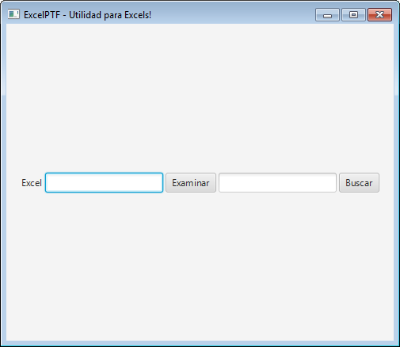

# Búsqueda dentro de un Excel  

Recordemos lo que nos propusimos:  
1. Crear una interfaz sencilla que nos permita seleccionar un Excel que esté en nuestra computadora. **(HECHO!)**  
2. **Vamos a buscar alguna palabra o número dentro del Excel e informar su ubicación.**  
3. Vamos a reemplazar una palabra por otra dentro de uno o mas Excels.  
4. Vamos a seleccionar un Excel y hacerle todas unas modificaciones y adaptarlo para que otro programa lo pueda leer.  

Ya tenemos la ruta donde está el archivo Excel que queremos usar. Ahora nos falta que nuestro programa lo abra.  
Ojo! Como usuario del programa, no vamos a ver la planilla abierta con su contenido. Lo que la aplicación va a hacer es abrirla internamente, para poder acceder a su contenido.  
Una vez que tengamos acceso a su contenido, buscaremos en todas las celdas para ver en cual de ellas se encuentra la palabra a buscar.  

Para eso, también necesitamos que la interfaz tenga un campo de texto en donde poner la palabra a buscar, y otro boton para realizar la búsqueda.  

## Interfaz  

Vamos a hacerlo muy sensillo. A nuestra clase **PanelSeleccionArchivo** le agregamos los siguientes componentes:  
1. Un objeto de tipo **TextField** que llamaremos *cajonDeTextoABuscar*.  
2. Un objeto de tipo **Button** que llamaremos *botonBuscar*.  

Para eso, primero, en la primer parte de la clase **PanelSeleccionArchivo**, en el mismo lugar donde tenemos los demas componentes declarados, agregamos los nuevos:  

```java  
public class PanelSeleccionArchivo extends HBox{

	Label texto;
	TextField cajonDeTexto;
	Button boton;
	Stage primaryStage;
	TextField cajonDeTextoABuscar;
	Button botonBuscar;
  .
  .
  .
```  

Luego, los inicializamos y agregamos al panel. Hacemos esto en el método *inicializarComponentes* que habíamos escrito:  
```java
	private void inicializarComponentes() {
		texto = new Label("Excel");
		getChildren().add(texto);

		cajonDeTexto = new TextField();
		getChildren().add(cajonDeTexto);

		boton = new Button("Examinar");
		getChildren().add(boton);
		
		cajonDeTextoABuscar = new TextField();
		getChildren().add(cajonDeTextoABuscar);
		
		botonBuscar = new Button("Buscar");
		getChildren().add(botonBuscar);
	}
```  
Ejecutamos la aplicación y si nos salió todo perfecto, ya veríamos los nuevos controles:  
  
Puede que la aplicación no sea muy atractiva todavía. Incluso puede ser que las palabras de los botones aparezcan recortadas. No le vamos a dar bola a eso por ahora.  
Mas adelante nos vamos a preocupar por mejorar la estética!  

## Abrir el Excel  

Listo! Ahora ya podemos abrir el excel y hacer la búsqueda.  
Haremos que cuando uno haga click en el botón de Buscar, se abra el Excel y se haga la búsqueda.  
Entonces, arranquemos con el **Handler**!  

### Handler de búsqueda  

Debemos agregar el código del **Handler** para el nuevo *botonBuscar*. Lo haremos en el método *crearHandlers* de la clase **PanelSeleccionadoArchivo** que ya tenemos hecho:  

Pero lo haremos de una forma distinta al anterior. Usaremos algo que se llama "expresión Lambda". Estas expresiones sirven para hacer el código mas córto.  

Comparemos como es el código del **Handler** que habíamos escrito para *boton* y como es el del *botonBuscar* que agregamos ahora:  

```java
	private void crearHandlers() {
		boton.setOnAction(new EventHandler<ActionEvent>() {
		    @Override public void handle(ActionEvent e) {
		    	FileChooser selectorDeArchivo = new FileChooser();
				selectorDeArchivo.setTitle("Abri el archivo Excel");

				File archivoSeleccionado = selectorDeArchivo.showOpenDialog(primaryStage);

				if (archivoSeleccionado != null) {
					String ruta = archivoSeleccionado.getAbsolutePath();
					cajonDeTexto.setText(ruta);
				}
		    }
		});

		botonBuscar.setOnAction(e -> buscar());
		
	}
```  

Que significa? Que cuando uno haga click en el *botonBuscar*, la acción que se disparará será ejecutar el método llamado *buscar*.  
No es mas corto de escribir, cómodo y ordenado? De eso se tratan las buenas prácticas!  

Agreguemos entonces el método *buscar*, para después llenarlo con el código necesario para la búsqueda:  

```java
	private void buscar(){
	
	}	
```  

### Búsqueda  

Dentro del método *buscar* ya podríamos escribir el código necesario para la apertura del archivo y búsqueda. Pero... podríamos ser mas ordenados!  
Imaginemos que nuestra aplicación crece y crece, y ya tiene 20 pantallas, y todas las pantallas acceden a archivos Excel. Y de pronto alguien nos cuenta que hay una forma mejor de abrir los Excel, o que la forma que usábamos no sirve para un tipo nuevo de Excel que acaba de salir. Tendríamos que abrir cada una de las 20 clases y modificarlas una por una con la nueva forma.  
Seguro que en alguno la pifiamos, además de ser un trabajo aburrido y repetitivo...  
Entonces, que hacemos? Otra vez, ordenamos y separamos las cosas en otra clase.  

### ExcelHelper  

#### Descargamos Apache POI  

Al comienzo habíamos hablado sobre la librería Apache POI
Vamos a crear una clase que llamaremos **ExcelHelper**. Le podemos pner el nombre que queramos, pero le ponemos así porque es una clase que nos va a ayudar (help en ingles) en todo lo que necesitemos hacer con Excels.  
La creamos:  

```java
package application;

public class ExcelHelper {

	
}
```  

Ahora, creamos un método que va a ser el encargado de buscar 
