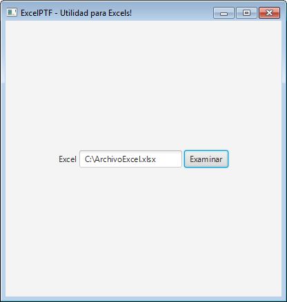

# Nuestra primer Interfaz
## Intentemos hacer lo siguiente:  

## Armemos el código!
### Imports
Vamos a usar algunos elementos nuevos, por lo que necesitamos avisarle al compilador de esto.
Estemos seguros que tenemos los siguientes **imports** en el inicio de nuestra clase **Main**:  
```java
import java.io.File;

import javafx.application.Application;
import javafx.event.ActionEvent;
import javafx.event.EventHandler;
import javafx.geometry.Pos;
import javafx.scene.Scene;
import javafx.scene.control.Button;
import javafx.scene.control.Label;
import javafx.scene.control.TextField;
import javafx.scene.layout.HBox;
import javafx.stage.FileChooser;
import javafx.stage.FileChooser.ExtensionFilter;
import javafx.stage.Stage;
```
Dentro del Try, vamos a hacer los siguientes cambios:
### HBox
Cambiamos el BorderPane por un HBox. Esta modificación solo nos cambia la organización de los elementos en pantalla.
```java
			HBox root = new HBox();
```
### Label
Creamos un objeto de tipo **Label**, lo llamamos *texto* y le asignamos el texto "Excel".  
Los Labels son textos en pantalla de una sola linea. Es el necesario y encargado de que muestre la palabra “Excel” en nuestra aplicación.
```java
			Label texto = new Label("Excel");
```
### TextField
Creamos un objeto de tipo **TextField** y lo llamamos *cajonDeTexto*.  
Los **TextFields** son los objetos de tipo cajon de texto que nos permiten introducir texto por nuestro teclado.
```java
			TextField cajonDeTexto = new TextField();
```
### Button 
Creamos un objeto de tipo **Button**, lo llamamos *boton* y le asignamos el texto "Examinar".
```java
			Button boton = new Button("Examinar");
```
### Agregamos los elementos
Hasta el momento, los objetos creados en las anteriores tres lineas (*texto*,*cajonDeTexto* y *boton*) existen, pero no están incluídos en la pantalla.  
Para esto los tenemos que agregar nosotros, y la forma es agregándolos al Panel (que en nuestro caso es el objeto *root* de tipo **HBox**). 
Se hace mediante el método **getChildren().add**. De esta forma, en cada linea agregamos cada uno de los objetos al panel *root*.
```java
			root.getChildren().add(texto);
			root.getChildren().add(cajonDeTexto);
			root.getChildren().add(boton);
```
### Propiedades de un **Panel**
Los paneles pueden tener muchas propiedades. Una de ella es la de **Alignment** (alineación). Al setear esa propiedad como “CENTER” le decimos que todos los objetos se centren en pantalla. Probá como se ve la aplicación si borramos esta linea.
```java
			root.setAlignment(Pos.CENTER);
			root.setSpacing(3);
```
También le asignamos la pripiedad **Spacing** con un valor de 3. El **Spacing** es el espacio que el panel pone entre cada elemento. Probá como se ve la aplicación si modificamos el valor de 3 a 15.
### Un título para el programa!
Con el método **setTitle** le agregamos un título a nuestra aplicación.
```java
			primaryStage.setTitle("ExcelPTF - Utilidad para Excels!");
```

## El código terminado
```java
package application;

import java.io.File;

import javafx.application.Application;
import javafx.event.ActionEvent;
import javafx.event.EventHandler;
import javafx.geometry.Pos;
import javafx.scene.Scene;
import javafx.scene.control.Button;
import javafx.scene.control.Label;
import javafx.scene.control.TextField;
import javafx.scene.layout.HBox;
import javafx.stage.FileChooser;
import javafx.stage.FileChooser.ExtensionFilter;
import javafx.stage.Stage;

public class Main extends Application {
	@Override
	public void start(Stage primaryStage) {
		try {
			HBox root = new HBox();

			Label texto = new Label("Excel");
			TextField cajonDeTexto = new TextField();
			Button boton = new Button("Examinar");

			root.getChildren().add(texto);
			root.getChildren().add(cajonDeTexto);
			root.getChildren().add(boton);

			root.setAlignment(Pos.CENTER);
			root.setSpacing(3);

			boton.setOnAction(new EventHandler<ActionEvent>() {
			    @Override public void handle(ActionEvent e) {
			    	FileChooser selectorDeArchivo = new FileChooser();
					selectorDeArchivo.setTitle("Abri el archivo Excel");
					selectorDeArchivo.getExtensionFilters().addAll(
							new ExtensionFilter("Archivos Excel", "*.xls","*.xlsx")							
							);
					File archivoSeleccionado = selectorDeArchivo.showOpenDialog(primaryStage);
					if (archivoSeleccionado != null) {
					   cajonDeTexto.setText(archivoSeleccionado.getAbsolutePath());
					}
			    }
			});

			Scene scene = new Scene(root,400,400);
			scene.getStylesheets().add(getClass().getResource("application.css").toExternalForm());
			primaryStage.setTitle("ExcelPTF - Utilidad para Excels!");
			primaryStage.setScene(scene);
			primaryStage.show();

		} catch(Exception e) {
			e.printStackTrace();
		}
	}


	public static void main(String[] args) {
		launch(args);
	}
}

```
